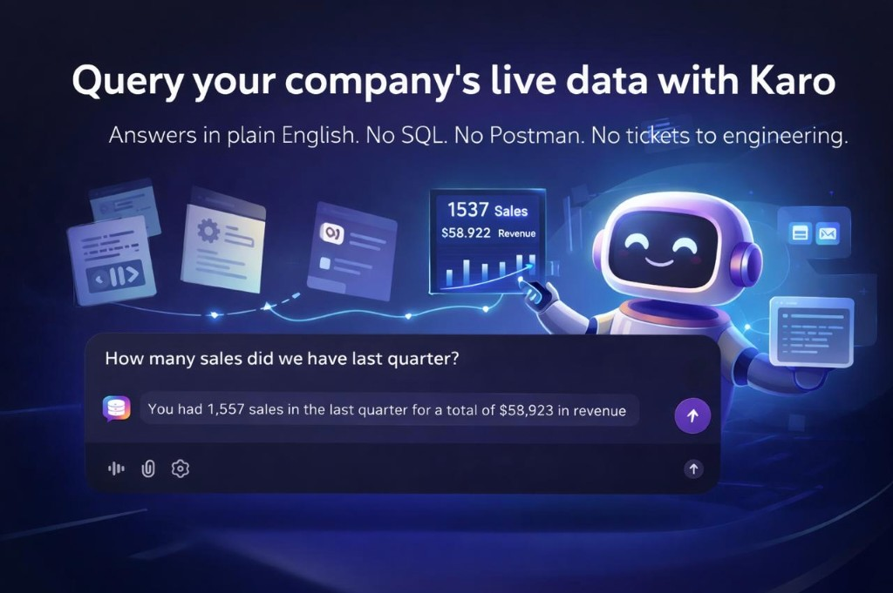
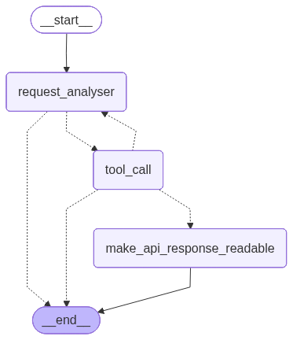

# Karo



An AI agent that ingests your company's internal knowledge — API docs, business rules, operational procedures — and lets anyone on the team query live data and get answers in plain English. No SQL. No Postman. No tickets to engineering.

**Video walkthrough:** [Karo — Building an AI Agent That Knows Your Company](https://youtube.com/playlist?list=PLQJcnbfcEQTTFeGbseG-k2VfKO4GEaHo1)

**System:** macOS (Intel or Apple Silicon) with Homebrew
**Purpose:** Hybrid API-calling + RAG agent that retrieves context from a pgvector knowledge base and calls external REST APIs to generate reports and answer questions.

---

## **TABLE OF CONTENTS**

1. [Architecture Overview](#1-architecture-overview)
2. [Prerequisites](#2-prerequisites)
3. [Install PostgreSQL](#3-install-postgresql)
4. [Install pgvector](#4-install-pgvector)
5. [Configure PATH](#5-configure-path)
6. [Create Database](#6-create-database)
7. [Setup Python Environment](#7-setup-python-environment)
8. [Environment Variables](#8-environment-variables)
9. [Add API Knowledge](#9-add-api-knowledge)
10. [Run Ingestion](#10-run-ingestion)
11. [Run the App](#11-run-the-app)
12. [Usage Examples](#12-usage-examples)
13. [Troubleshooting](#13-troubleshooting)
14. [Cleanup](#14-cleanup)

---

## **1. ARCHITECTURE OVERVIEW**

### LangGraph Node Flow



### Project Modules

```
backend/
├── agent.py      Public API: get_agent() + ask_agent()
├── config.py     Env vars, constants, per-request auth (ContextVar)
├── graph.py      LangGraph StateGraph: nodes, routing, graph assembly
├── helpers.py    Pure utilities: extraction, truncation, field matching
├── prompts.py    System prompts for analyser and formatter nodes
└── tools.py      Tool definitions: semantic_search_tool, APIInput, ready_to_format
```

### Data Flow

```
User Question (Chainlit chat)
          │
          ▼
┌─────────────────────────────────────────────────────┐
│  ask_agent()  (backend/agent.py)                    │
│  Sets auth tokens via ContextVar, invokes the graph │
└──────────────────────┬──────────────────────────────┘
                       │
          ┌────────────┼─────────────────┐
          ▼            ▼                 ▼
  ┌──────────────┐  ┌───────────┐  ┌──────────────────┐
  │ semantic_    │  │ APIInput  │  │ ready_to_format  │
  │ search_tool  │  │ HTTP call │  │ Signal tool      │
  │ RAG over     │  │ Injects   │  │ Routes to        │
  │ pgvector     │  │ auth via  │  │ formatter node   │
  │              │  │ ContextVar│  │                  │
  └──────┬───────┘  └─────┬─────┘  └──────────────────┘
         │                │
         ▼                ▼
┌────────────────┐  ┌────────────────────┐
│ PostgreSQL     │  │ External REST APIs │
│ (pgvector)     │  │ (configured in     │
│ knowledge_     │  │ knowledge_         │
│ chunks         │  │ chunks.txt)        │
└────────────────┘  └────────────────────┘

  Conversation history stored in PostgreSQL via LangGraph PostgresSaver
```

---

## **2. PREREQUISITES**

- macOS (Intel or Apple Silicon)
- Homebrew installed
- Python 3.12+ installed
- [uv](https://docs.astral.sh/uv/) installed
- OpenAI API key (get one at https://platform.openai.com/api-keys)
- API token for the external REST APIs the agent will call

### Verify Prerequisites

```bash
brew --version       # Homebrew 4.x+
python --version     # Python 3.12+
uv --version         # uv 0.x+
```

### Install uv (if not already installed)

```bash
brew install uv
```

---

## **3. INSTALL POSTGRESQL**

```bash
brew update
brew install postgresql@15

# Start and enable on login
brew services start postgresql@15
brew services list | grep postgresql@15
# Expected: postgresql@15  started  ...
```

---

## **4. INSTALL PGVECTOR**

```bash
brew install pgvector
```

---

## **5. CONFIGURE PATH**

**Intel Mac:**

```bash
sed -i '' '/postgresql@15/d' ~/.zshrc
echo 'export PATH="/usr/local/opt/postgresql@15/bin:$PATH"' >> ~/.zshrc
source ~/.zshrc

which psql      # /usr/local/opt/postgresql@15/bin/psql
```

**Apple Silicon Mac:**

```bash
sed -i '' '/postgresql@15/d' ~/.zshrc
echo 'export PATH="/opt/homebrew/opt/postgresql@15/bin:$PATH"' >> ~/.zshrc
source ~/.zshrc

which psql      # /opt/homebrew/opt/postgresql@15/bin/psql
```

---

## **6. CREATE DATABASE**

```bash
# Create a PostgreSQL superuser matching your macOS username (if needed)
createuser -s $(whoami)

# Create the application database
createdb qmrdb

# Enable pgvector
psql qmrdb -c "CREATE EXTENSION IF NOT EXISTS vector;"
```

> **✅ Checkpoint:** `qmrdb` exists and pgvector is enabled.
> PostgreSQL is used for two things: **pgvector embeddings** (knowledge base) and **LangGraph conversation checkpoints**. No application data tables are required.

---

## **7. SETUP PYTHON ENVIRONMENT**

```bash
cd /path/to/Karo

# Install all dependencies from pyproject.toml into a managed .venv
uv sync
```

All subsequent commands (`uv run python ...`) automatically use the project's virtual environment — no manual activation needed.

**Key dependencies** (see `pyproject.toml`):

| Package                                      | Purpose                                       |
| -------------------------------------------- | --------------------------------------------- |
| `langchain`, `langchain-openai`              | LLM + tools framework                         |
| `langchain-postgres`                         | pgvector vector store                         |
| `langgraph`, `langgraph-checkpoint-postgres` | Agent graph + persistent conversation history |
| `psycopg[binary]`, `psycopg2-binary`         | PostgreSQL drivers                            |
| `chainlit`                                   | Web chat UI (text + optional voice)           |
| `faster-whisper`                             | Server-side speech-to-text for voice input    |
| `python-dotenv`                              | `.env` loading                                |

---

## **8. ENVIRONMENT VARIABLES**

Create a `.env` file in your project root:

```bash
cat > .env << 'EOF'
# OpenAI
OPENAI_API_KEY=sk-your-actual-openai-key-here

# PostgreSQL — used for pgvector embeddings and LangGraph checkpoints
DATABASE_URL=postgresql://localhost:5432/qmrdb

# (Optional) separate DB for LangGraph checkpoints — defaults to DATABASE_URL
CHECKPOINT_DB_URL=postgresql://localhost:5432/qmrdb

# pgvector collection name (must match what ingest.py wrote)
VECTOR_COLLECTION=qmr_knowledge_chunks

# Path to API knowledge chunks file
CHUNKS_FILE=knowledge_chunks.txt

# Bearer token injected automatically into every API call
API_TOKEN=your-api-token-here
EOF
```

> **⚠️ IMPORTANT:** Replace placeholder values with your real credentials. `API_TOKEN` is injected automatically into every `api_call` — never hardcode it in knowledge chunks.

---

## **9. ADD API KNOWLEDGE**

The agent has no built-in knowledge of your APIs. You teach it by writing knowledge chunks in `knowledge_chunks.txt`. Read `instructions.md` for the full authoring guide.

Each chunk covers one aspect of one endpoint:

| Chunk                          | What it covers                                     |
| ------------------------------ | -------------------------------------------------- |
| `[Name] — Endpoint and Method` | URL, HTTP method, authentication note              |
| `[Name] — Required Parameters` | Fields the agent MUST collect before calling       |
| `[Name] — Optional Parameters` | Fields with defaults or that can be omitted        |
| `[Name] — Response`            | Response shape, field paths, download URL handling |

**Minimal example:**

```text
---
title: My Report API — Endpoint and Method
tags: topic:endpoint, applies_to:my_report, api_template
content:
Purpose:
- Generates a sales report for the given date range.

Endpoint:
- Method: POST
- URL: https://api.example.com/v1/reports/sales

Payload/Headers:
- Content-Type: application/json
- Auth token is injected automatically — do NOT ask the user for it.
---

---
title: My Report API — Required Parameters
tags: topic:parameters, applies_to:my_report, business_rule
content:
Before calling this endpoint you MUST collect:
- region     : string — e.g. "Dhaka", "Rajshahi"
- start_date : string YYYY-MM-DD
- end_date   : string YYYY-MM-DD

Do NOT call the API until all three are provided.
---
```

After adding or editing chunks, re-run ingestion (see next section).

---

## **10. RUN INGESTION**

Ingestion reads `knowledge_chunks.txt`, generates embeddings, and stores them in pgvector.
Run this **once initially**, then again whenever `knowledge_chunks.txt` changes.

```bash
uv run python ingest.py
```

**Expected output:**

```
======================================================================
QMR KNOWLEDGE (.TXT) TO VECTOR INGESTION
======================================================================

📄 Loading QMR knowledge chunks from: knowledge_chunks.txt
   ✓ Loaded 30 knowledge chunks

📊 Ingestion Summary:
   Total documents: 30
   Estimated tokens: ~7,500
   Estimated cost: ~$0.0002

🚀 Generating embeddings (this may take some seconds)...

✅ Success! Created 30 embeddings
   Collection name: qmr_knowledge_chunks
   Storage: PostgreSQL (pgvector)

======================================================================
✅ INGESTION COMPLETE!
======================================================================
```

> **✅ Checkpoint:** All knowledge chunks embedded and stored. The document count will vary depending on how many chunks are in `knowledge_chunks.txt`.

---

## **11. RUN THE APP**

### Chainlit (recommended)

```bash
uv run chainlit run app.py
```

Open http://localhost:8000 in your browser (Chainlit prints the exact URL in the terminal if it differs).

The UI supports **text chat** and **voice**: use the microphone control to speak; audio is transcribed on the server with faster-whisper, then sent to the agent like a typed message.

Open the **chat settings** panel (Chainlit’s settings control for the thread) and enable **Show debug / raw response** to expand raw graph output and retrieved knowledge chunks after each reply.

### Programmatic usage

```python
from backend.agent import ask_agent

result = ask_agent(
    question="Generate a sales report for Dhaka, January 2025",
    thread_id="my-session-001",
)
print(result["answer"])
```

`ask_agent` returns:

```python
{
    "answer": "...",           # Final assistant message
    "artifacts": {
        "semantic_search_docs": [...],   # Knowledge chunks retrieved (if any)
        "api_responses": [...],          # Raw API responses (if any)
    },
    "raw": {...}               # Full LangGraph result (messages, metadata, etc.)
}
```

Each call is tied to a `thread_id` — LangGraph persists conversation history in PostgreSQL so the agent remembers context across turns.

---

## **12. USAGE EXAMPLES**

The examples below assume you have added the sample "My Report API" chunks from section 9. Replace them with examples that match your own knowledge chunks.

### Generate a sales report

**Prompt:**

> Generate a sales report for Dhaka from January 1 to January 31, 2025

**Agent behaviour:** Searches knowledge base for the report endpoint, collects the required parameters (region, start_date, end_date), calls the API, and presents the result with a download link if available.

### Ask without all required parameters

**Prompt:**

> Give me a sales report

**Agent behaviour:** Finds the endpoint documentation, notices region and date range are missing, and asks the user to provide them before making the API call.

### Debug mode

In **chat settings**, enable **Show debug / raw response** to inspect:

- Which knowledge chunks the agent retrieved
- The raw graph output (including tool results) before formatting

---

## **13. TROUBLESHOOTING**

### `psql: command not found`

```bash
# Intel Mac
echo 'export PATH="/usr/local/opt/postgresql@15/bin:$PATH"' >> ~/.zshrc
# Apple Silicon Mac
# echo 'export PATH="/opt/homebrew/opt/postgresql@15/bin:$PATH"' >> ~/.zshrc

source ~/.zshrc
```

### PostgreSQL not running

```bash
brew services list | grep postgresql@15
brew services start postgresql@15
```

### `CREATE EXTENSION vector` fails

```bash
brew reinstall pgvector
psql qmrdb -c "CREATE EXTENSION IF NOT EXISTS vector;"
```

### `DATABASE_URL is not set` or missing env vars

Ensure `.env` exists in your working directory and contains all required keys. Double-check with:

```bash
cat .env | grep -E "DATABASE_URL|API_TOKEN|OPENAI_API_KEY"
```

### `No module named 'langchain'` (or any other package)

Sync dependencies from `pyproject.toml`:

```bash
uv sync
```

### Agent says it doesn't know about an endpoint

The agent only knows what is in `knowledge_chunks.txt`. Add the missing endpoint documentation as new chunks, then re-run ingestion:

```bash
uv run python ingest.py
```

Enable **Show debug / raw response** in Chainlit’s chat settings to see which chunks were (or weren't) retrieved for a query.

### Agent calls the wrong endpoint or uses wrong parameters

1. Check the relevant chunk in `knowledge_chunks.txt` — ensure the title is descriptive and the content is precise.
2. Re-run ingestion after any edits.
3. Check that `VECTOR_COLLECTION` in `.env` matches the collection used during ingestion.

### `Expected BaseCheckpointSaver, got ...`

Ensure `langgraph` and `langgraph-checkpoint-postgres` are installed and up to date:

```bash
uv add --upgrade langgraph langgraph-checkpoint-postgres
```

### API calls return `401 Unauthorized`

Verify `API_TOKEN` is set correctly in `.env`. The token is injected as a `Bearer` header automatically — never put it in knowledge chunks.

---

## **14. CLEANUP**

### Stop services

```bash
brew services stop postgresql@15
```

### Drop database

```bash
dropdb qmrdb
```

### Remove project virtual environment

```bash
rm -rf .venv
```

### Uninstall (optional)

```bash
brew uninstall postgresql@15
brew uninstall pgvector
sed -i '' '/postgresql@15/d' ~/.zshrc && source ~/.zshrc
```

---

**Questions?** Review the troubleshooting section or ask the agent directly via `app.py` (Chainlit). To add new APIs, see `instructions.md`.
